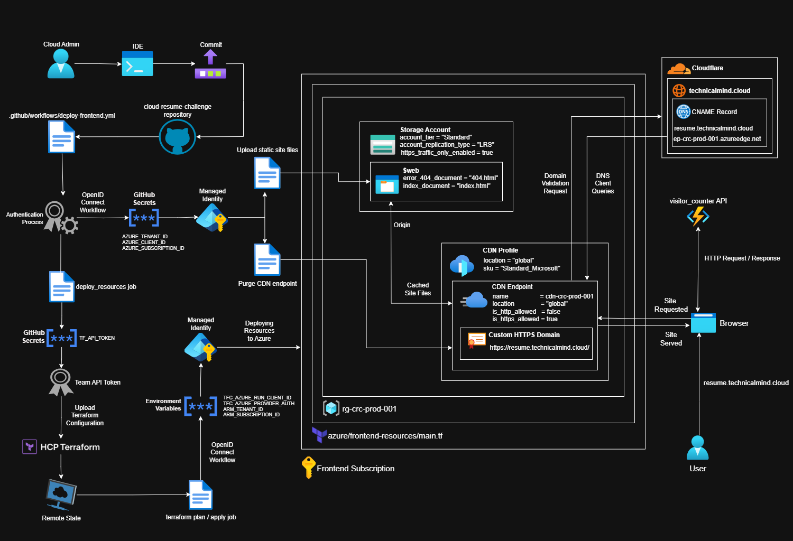
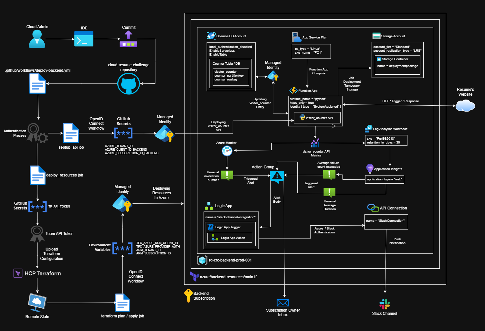

# 🌥️ cloud-resume-challenge

Welcome to my repository for the Cloud Resume Challenge Bootcamp (Q4 2025) organized by ExamPro.
Here you’ll find **Terraform** files, **GitHub Actions** workflows, **Python** applications, diagrams, resume website files and complete documentations to setup and deploy a working Cloud Resume Challenge using different cloud providers (only the Azure version is available for now).

## 🥈 Recognition

Awarded the **Captain Badge** for **Outstanding** performance in the bootcamp's final submission.

<p align="center">
<a href="https://app.exampro.co/validate/certificate/-YSmuilBw4xEuBFkxXQcKQ17211" target="_blank">
    
    </a>
</p>

## 🌐 Live Sites

[resume.technicalmind.cloud](https://resume.technicalmind.cloud/) (Azure)

## 🖼️ Diagrams

### Azure Frontend Architecture



### Azure Backend Architecture



If you need to make changes to these diagrams, you can download an editable copy for the [backend](./azure/backend-resources/images/backend-resources-architecture.drawio) and the [frontend](./azure/frontend-resources/images/frontend-resources-architecture.drawio) respectively. You'll need to use **draw.io** to open the files, there's a [web version](https://app.diagrams.net/) and an [offline version](https://www.drawio.com/) of this software (no registration is required to use it).

For implementation steps [go to the Azure section](#️-sections)

## 🗒️ Sections

- [Frontend Technical Specifications](./frontend/README.md)
- [Azure Version for the Cloud Resume Challenge](./azure/README.md)
  - [Writing and Deploying the Cloud Resume Challenge's Frontend](./azure/frontend-resources/README.md)
  - [Writing and Deploying the Cloud Resume Challenge's Backend](./azure/backend-resources/README.md)

## 🗂️ Repository Structure

```txt
.
├── .github/
│   └── workflows/
│       ├── deploy-backend.yml          # Github Actions workflow to deploy backend resources
│       └── deploy-frontend.yml         # Github Actions Workflow to deploy frontend resources
├── azure/
│   ├── README.md                       # Table of contents for Azure docs
│   ├── backend-resources/
│   │   ├── .gitignore
│   │   ├── .terraform.lock.hcl
│   │   ├── README.md                   # Azure Backend deployment docs
│   │   ├── create-entity-module/
│   │   │   ├── create_entity.py        # Python app to create visitor_counter entity
│   │   │   └── requirements.txt        # create_entity.py dependencies
│   │   ├── images/                     # Images for Azure backend docs
│   │   ├── main.tf                     # Main file to write terraform resources
│   │   ├── provider.tf                 # Terraform provider settings
│   │   ├── terraform.tf                # Terraform settings
│   │   ├── variables.tf                # Terraform variables to be used in main.tf
│   │   └── visitor-counter/
│   │       ├── function_app.py         # Visitor Counter API 
│   │       ├── host.json               # Azure Function settings
│   │       ├── requirements.txt        # Visitor Counter API dependencies
│   │       
└── visitor-counter.zip                 # Visitor counter API zipped artifact
│   └── frontend-resources/
│       ├── .gitignore
│       ├── .terraform.lock.hcl
│       ├── README.md                   # Azure frontend deployment docs
│       ├── images/                     # Images for Azure frontend docs
│       ├── main.tf                     # Main file to write terraform resources
│       ├── provider.tf                 # Terraform provider settings
│       ├── terraform.tf                # Terraform settings
│       └── variables.tf                # Terraform variables to be used in main.tf
├── frontend/
│   ├── README.md                       # Cloud Resume Challenge app docs
│   └── resume/
│       ├── index.html                  # Cloud Resume Challenge app
│       ├── docs/
│       │   └── images/                 # Cloud Resume Challenge app images for docs
│       └── src/
│           ├── images/                 # Cloud Resume Challenge app images
│           ├── styles/
│           │   ├── styles.css          # Cloud Resume Challenge app styling sheets
│           │   └── fonts/              # Cloud Resume Challenge app fonts
│           └── visitor-counter/
│               └── visitor-counter.js  # Visitor counter API integration
├── README.md                           # ← You are here!
└── .gitignore
```

## 📌 How to Use This Repo

1. **Clone & explore**:

    ```sh
    git clone https://github.com/vegasjj/cloud-resume-challenge.git
    cd cloud-resume-challenge
    ```

2. **Read walkthroughs and notes**: For notes, steps taken and troubleshooting follow the relevant links in [Sections](#️-sections).
