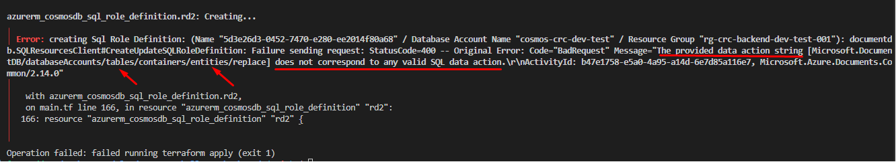
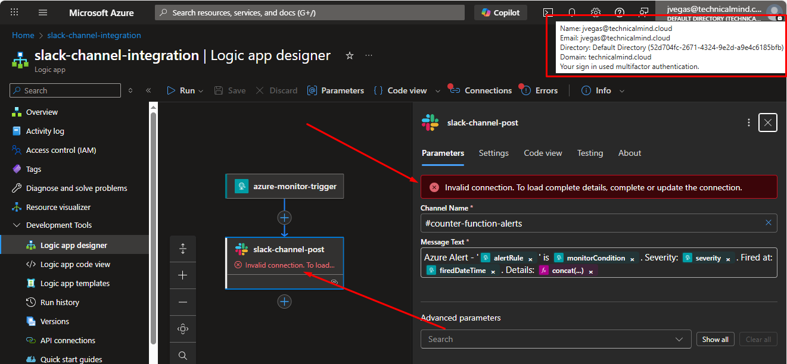
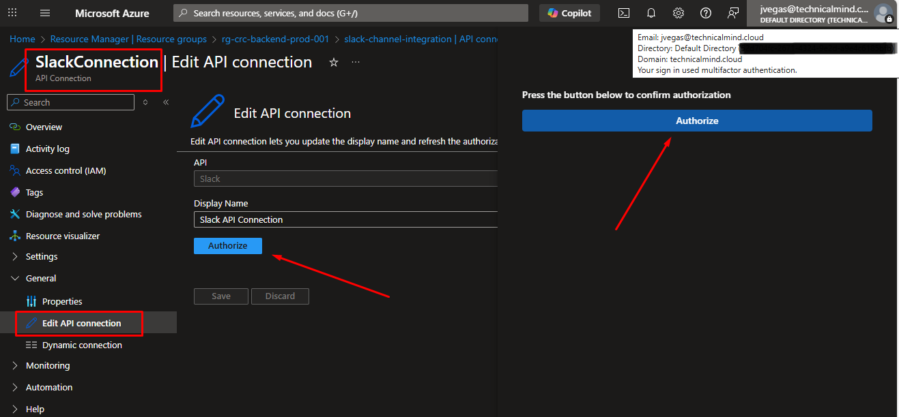
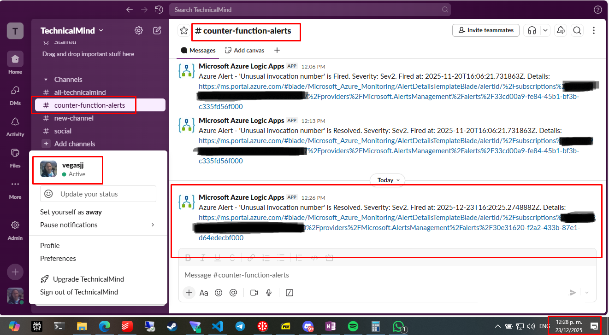

# Writing and Deploying the Cloud Resume Challenge's Backend

In the [first part of the backend](#setting-up-the-api), we need to serve an API in charge of receiving requests from the resume's webpage, connect with a database to update the visitor counter and send back the updated valued to the resume.

For the [second part](#setting-up-monitoring-and-notifications), we will be setting up monitoring and notifications to keep track of our API in a timely manner.

## Local Development Environment details

The following tools need to be installed to support local development:

- Azure CLI.
- Terraform CLI. ([Bicep](https://learn.microsoft.com/en-us/azure/azure-resource-manager/bicep/overview?tabs=bicep) is also an option to handle [infrastructure as code](https://learn.microsoft.com/en-us/devops/deliver/what-is-infrastructure-as-code) (IaC) natively in Azure but I chose to use [Terraform](https://developer.hashicorp.com/terraform) because we can use it to support multi-cloud environments)
- Python.
- Azure Functions Core Tools.
- Azure Functions extension for VS Code.

### Setting Up Azure CLI

You can refer to [Setting up Azure CLI](../frontend-resources/README.md#setting-up-azure-cli) in case you haven't already do so. Also, I recommend using a different subscription for the backend resources to track potential expenses separately and keep things more organized, besides, this pattern will allow for another authorization boundary to minimize the attack surface.

### Setting Up Terraform

You can refer to [Setting up Terraform](../frontend-resources/README.md#setting-up-terraform) in case you haven't already do so. I recommend using a different workspace in **Terraform Cloud** so you can manage the backend's states separately from the frontend's, for instance, you could tear down (using `terraform destroy`) and reconstruct the backend resources without worrying of affecting the frontend if you want to.

This time around, you can use a local state and later migrate to a remote state or start with remote state from the beginning while testing your configuration, is up to you.

It is not necessary to setup another API token to authenticate with **Terraform Cloud** locally if you are working on the same development environment. Just make sure to be running the same version of terraform in both workspaces as **Terraform CLI** can get confused by this.

When [setting up the terraform files](../frontend-resources/README.md#setting-up-terraform-files) for the backend, make sure to use the information in the [`azure/backend-resources`](./) directory to create them. Specifically, you need to refer to [`provider.tf`](./provider.tf), [`terraform.tf`](./terraform.tf), [`variables.tf`](./variables.tf) and [`main.tf`](./main.tf).

### Setting up Python

As **Python** will be the language of choice to code the **visitor counter API** you need to select and install a [supported version](https://learn.microsoft.com/en-us/azure/azure-functions/functions-reference-python?tabs=get-started%2Casgi%2Capplication-level&pivots=python-mode-decorators#python-version) from the [download page](https://www.python.org/downloads/).

If you are using **GitHub Codespaces**, **Python** is already preinstalled.

### Setting Up Azure Functions Core Tools

In GitHub Codespaces you don't need to configure Microsoft repository to install [Azure Functions Core Tools](https://learn.microsoft.com/en-us/azure/azure-functions/functions-run-local?tabs=linux%2Cisolated-process%2Cnode-v4%2Cpython-v2%2Chttp-trigger%2Ccontainer-apps&pivots=programming-language-python), but you might need to if you are using your own PC.

To install **Azure Functions Core Tools**, run:

```sh
sudo apt-get install azure-functions-core-tools-4
```

### Setting Up the Azure Functions Extension for VS Code

Go to the [Azure Functions download page](https://marketplace.visualstudio.com/items?itemName=ms-azuretools.vscode-azurefunctions) to install the extension.

Next, create the `visitor-counter` directory for your API under `path/to/repo/azure/backend-resources/` (replace `path/to/repo` with your actual repo's path):

```sh
cd path/to/repo/azure/backend-resources/
mkdir visitor-counter
```

Now, you need to configure your local environment to develop your **Azure function**. The easier way to do it is to use [this guide](https://learn.microsoft.com/en-us/azure/azure-functions/functions-develop-vs-code?tabs=node-v4%2Cpython-v2%2Cisolated-process%2Cquick-create&pivots=programming-language-python#create-an-azure-functions-project) to generate all the files and boilerplate automatically in the `visitor-counter` directory (trust me, you'll be saving yourself a lot of headaches this way). Just make sure to select Python (and the specific version you need) as the function language (you can select all other options with their defaults as they can be overridden with the API code)

## Setting Up the API

To set up the API we will need:

- A function app where the API will be configured using an Azure function.
- An app service plan to provide compute for the API.
- A storage account to keep the API files and support temporary storage for the function app's deployments.
- A cosmos db account (using the table API) to act as the database.

All of this resources are declared in the [`main.tf`](./main.tf) file for the backend resources and you can just copy and paste my code (which I will explain in detail bellow).

### Setting Up Compute and Storage

For the **function app** we first need to setup the **storage account** and the **app service plan**.

#### The App Service Plan

```sh
resource "azurerm_service_plan" "sp" {
  name                = var.service_plan_name
  resource_group_name = azurerm_resource_group.rg.name
  location            = azurerm_resource_group.rg.location
  os_type             = "Linux"
  sku_name            = "FC1"
}
```

Here we use a service plan with **Linux** as its operating system in the `FC1` sku which is needed to use with a [Flex Consumption function app](https://learn.microsoft.com/en-us/azure/azure-functions/flex-consumption-plan).

#### The Storage Account

```sh
resource "azurerm_storage_account" "st" {
  name                            = var.storage_account_name
  resource_group_name             = azurerm_resource_group.rg.name
  location                        = azurerm_resource_group.rg.location
  account_tier                    = "Standard"
  account_replication_type        = "LRS"
  allow_nested_items_to_be_public = false
  # shared_access_key_enabled = false
}

resource "azurerm_storage_container" "sc" {
  name                  = "deploymentpackage"
  storage_account_id  = azurerm_storage_account.st.id
}
```

Here, we have a storage account setup on the `standard` tier and using `LRS` (Locally Redundant Storage) replication for cost effectiveness. Also, nested items are configured to never been public.

The `shared_access_key_enabled = false` line is commented out to disable access keys (in favor or managed identities) in a future version for improved security (as of December 2025, creation of storage accounts without access keys using the `azurerm` provider enable is not reliable enough).

Finally, we create a blob container called `deploymentpackage` withing the **storage account** to be used for the **function app** for temporary storage during deployments.

#### The Function App

With the dependencies configured, we can now proceed with the **function app**:

```sh
resource "azurerm_function_app_flex_consumption" "func" {
  name                                     = var.function_app_name
  resource_group_name                      = azurerm_resource_group.rg.name
  location                                 = azurerm_resource_group.rg.location
  service_plan_id                          = azurerm_service_plan.sp.id
  
  storage_container_type                   = "blobContainer"
  storage_container_endpoint               = "${azurerm_storage_account.st.primary_blob_endpoint}${azurerm_storage_container.sc.name}"
  storage_authentication_type              = "StorageAccountConnectionString"
  storage_access_key                       = azurerm_storage_account.st.primary_access_key
  runtime_name                             = "python"
  runtime_version                          = "3.12"
  webdeploy_publish_basic_authentication_enabled = false
  client_certificate_mode                  = "Required"
  https_only                               = true
  identity {
    type = "SystemAssigned"
  }
  
  site_config {
    application_insights_connection_string = azurerm_application_insights.ai.connection_string
    http2_enabled                          = true
    cors {
      allowed_origins = ["https://portal.azure.com", "https://resume.technicalmind.cloud"]
    }
  }

  app_settings = {
    COSMOS_DB_ACCOUNT_NAME  = var.cosmosdb_account_name
    COSMOS_DB_PARTITION_KEY = "counter_partitionkey"
    COSMOS_DB_ROW_KEY       = "counter_rowkey"
    COSMOS_DB_TABLE_NAME    = var.cosmosdb_table_name
  }
  tags = { 
    "hidden-link: /app-insights-resource-id" = azurerm_application_insights.ai.id
   }
}
```

As you can see, the `azurerm_function_app_flex_consumption` resource provider is used to setup a [Flex Consumption function app](https://learn.microsoft.com/en-us/azure/azure-functions/flex-consumption-plan) that for its serverless nature is just right for our needs both in cost (virtually zero) and performance (as [cold starts](https://azure.microsoft.com/en-us/blog/understanding-serverless-cold-start/) are not an issue for us).

Also, the **app service plan** and the **blob container** we configured above are linked. In the case of the **blob container** we use the storage account's access keys for authentication.

For the supported language **Python 3.12** is chosen.

Basic authentication (for deployments) is disabled for security reasons with the line `webdeploy_publish_basic_authentication_enabled = false` and http traffic is disallowed with `https_only = true`.

To simplify authentication with the database and avoid managing secrets manually or in code the **function app** is configured with a **system assign managed identity**:

```sh
identity {
    type = "SystemAssigned"
  }
```

The `application_insights_connection_string` in the `site_config`'s block points to the application insights instance that will be linked with the **function app**, but this will explore in more depth in the [second part](./README.md#setting-up-monitoring-and-notifications).

[CORS](https://developer.mozilla.org/en-US/docs/Web/HTTP/Guides/CORS) is setup allow request from the resume's URL (`https://resume.technicalmind.cloud`) and from the Azure Portal (`https://portal.azure.com`) in case you want to test the function from the **function app's** GUI.

The `app_settings` block declares the environment variables that will be needed for the API to locate the database, table and entity where the visitor counter valued is stored.

### Setting Up the Database

To setup the database is is necessary to configure the [Azure Cosmos DB account](https://learn.microsoft.com/en-us/azure/cosmos-db/overview) itself and a **table** using the [Azure Cosmos DB for Table](https://learn.microsoft.com/en-us/azure/cosmos-db/table/overview) API where the entity that will save the visitor counter will live.

#### Setting Up the Cosmos DB Account

```sh
resource "azurerm_cosmosdb_account" "db" {
  name                            = var.cosmosdb_account_name
  location                        = azurerm_resource_group.rg.location
  resource_group_name             = azurerm_resource_group.rg.name
  offer_type                      = "Standard"
  local_authentication_disabled   = true

  tags = {
    defaultExperience = "Azure Table"
  }

  backup {
      type = "Continuous"
      tier = "Continuous7Days"
    }

  capabilities {
      name = "EnableServerless"
    }

  capabilities {
    name = "EnableTable"
  }

  capacity {
    total_throughput_limit = 4000
  }
  
  consistency_policy {
    consistency_level       = "BoundedStaleness"
    max_interval_in_seconds = 86400
    max_staleness_prefix    = 1000000
  }
  geo_location {
    location          = var.location
    failover_priority = 0
  }
}
```

In the code snippet above, you can see the line `local_authentication_disabled = true` disables authentication using **connections strings**, which improves security, as the **function app** hosting the API will authenticate with the database using a **managed identity** (more on that [below](#setting-up-authentication-between-the-database-and-function-app)).

Also, the serverless capability for the **Cosmos DB** account is enabled by setting the `EnableServerless` value for cost effectiveness as well as the free tier for the backups set to `Continuous7Days`.

The `EnableTable` capability prepares the **Cosmos DB** account to use the **Cosmos DB for table** API.

#### Setting Up the Table

```sh
resource "azurerm_cosmosdb_table" "tb" {
  name                = var.cosmosdb_table_name
  resource_group_name = azurerm_resource_group.rg.name
  account_name        = azurerm_cosmosdb_account.db.name
}
```

Here, we simply configure the table name and link it to the **Cosmos DB** account already setup.

#### Setting Up the Entity

The **Cosmos DB for table** API uses [entities](https://learn.microsoft.com/en-us/azure/cosmos-db/table/overview#data) (rows) to store values in the form of key-value pairs, however, **Terraform** cannot create it because this configuration belongs to the data plane (is not infrastructure).

For this reason, you need to use small **Python** application (using the [Azure SDK for Python](https://pypi.org/project/azure-data-tables/)) which will be setup in the `azure/backend-resources/create-entity-module` directory in your repo's path:

```sh
cd /path/to/repo/azure/backend-resources/
mkdir create-entity-module
```

You can recreate [my own implementation](./create-entity-module/) for this purpose. If you review [`create_entity.py`](./create-entity-module/create_entity.py) file you'll see this:

```sh
from azure.data.tables import TableServiceClient
from azure.identity import DefaultAzureCredential
from azure.core.exceptions import ResourceNotFoundError
import os
# from dotenv import load_dotenv

# load_dotenv()

required_vars = ['COSMOS_DB_ACCOUNT_NAME', 'COSMOS_DB_TABLE_NAME', 
                 'COSMOS_DB_PARTITION_KEY', 'COSMOS_DB_ROW_KEY']
missing_vars = [var for var in required_vars if not os.getenv(var)]
if missing_vars:
    raise ValueError(f"Missing required environment variables: {', '.join(missing_vars)}")

account_name = os.getenv('COSMOS_DB_ACCOUNT_NAME')
table_name = os.getenv('COSMOS_DB_TABLE_NAME')
partition_key = os.getenv('COSMOS_DB_PARTITION_KEY')
row_key = os.getenv('COSMOS_DB_ROW_KEY')

credential = DefaultAzureCredential()
table_service_client = TableServiceClient(
    endpoint=f"https://{account_name}.table.cosmos.azure.com:443/",
    credential=credential
)
table_client = table_service_client.get_table_client(table_name)

entity = {
    'PartitionKey': partition_key,
    'RowKey': row_key,
    'visitor_counter': 0,
}

try:
    table_client.get_entity(partition_key, row_key)
    print("Entity already exists; no action taken")
except ResourceNotFoundError:
    table_client.create_entity(entity)
    print("Entity created successfully")

```

In short, this code authenticates to the [Cosmos DB](#setting-up-the-cosmos-db-account) account you created earlier (using a **managed identity**) and then configures and initialize an entity in the [table](#setting-up-the-table) you already setup if it hasn't been created already by this [GitHub Actions workflow](#executing-the-create-entity-module-app) which will be in charge to execute this process.

If you wish to test in your local environment you can uncomment this lines:

```sh
# from dotenv import load_dotenv

# load_dotenv()
```

Also, you need to set your `.env` file based on [`.env.example`](./create-entity-module/.env.example).

### Setting Up Authentication Between the Database and Function App

As mentioned before, the **Cosmos DB** account cannot be accessed using connection strings so we need a way to the API authenticates securely to the database's data plane with permissions to update the entity storing the visitor counter.

For this purpose, we proceed to configure a custom role definition which can only read and update an entity at the scope of our **Cosmos DB**  account:

```sh
resource "azurerm_cosmosdb_sql_role_definition" "rd" {
  name                = "Azure Cosmos DB for Table Visitor Counter contributor"
  resource_group_name = azurerm_resource_group.rg.name
  account_name        = azurerm_cosmosdb_account.db.name
  assignable_scopes   = [azurerm_cosmosdb_account.db.id]
  permissions {
    data_actions = [
          "Microsoft.DocumentDB/databaseAccounts/readMetadata",
          "Microsoft.DocumentDB/databaseAccounts/sqlDatabases/containers/items/read",
          "Microsoft.DocumentDB/databaseAccounts/sqlDatabases/containers/items/replace"
    ]
  }
}
```

Above, you can see the **custom role definition** is named `Azure Cosmos DB for Table Visitor Counter contributor`

If you are observant, and have studied the [Cosmos DB for Table data plane security reference](https://learn.microsoft.com/en-us/azure/cosmos-db/table/reference-data-plane-security#built-in-actions), you might have noticed I'm using `sqlDatabases` instead of `tables` and `items` instead `entities`. This seems like an error, but is not.

For some reason, the `azurerm_cosmosdb_sql_role_definition` provider doesn't still support the specific syntax for the **Cosmos DB for table** API and if you attempt to use you receive an `invalid SQL data action` error:



However, even if you use the syntax for the **Cosmos DB for SQL** API it works just fine... a mystery, I know.

Next, we need to assign our custom role to the **managed identity** associated with the **function app** (using Azure RBAC) so that the API can authenticate with the table in the **Cosmos DB** account and update the visitor counter accordingly:

```sh
resource "azurerm_cosmosdb_sql_role_assignment" "ra" {
  resource_group_name = azurerm_resource_group.rg.name
  account_name        = azurerm_cosmosdb_account.db.name
  role_definition_id  = azurerm_cosmosdb_sql_role_definition.rd.id
  principal_id        = azurerm_function_app_flex_consumption.func.identity.0.principal_id
  scope               = azurerm_cosmosdb_account.db.id
}
```

With all this setup, we had provided secure authentication **without manual secret management, applying the principle of least privilege**, so only our API can talk to the database and execute a specific action.

### Setting Up the Azure Function

If you installed and setup [Python](#setting-up-python), [Azure Functions core tools](#setting-up-azure-functions-core-tools) and the [Azure Functions extension for VS Code](#setting-up-the-azure-functions-extension-for-vs-code) you are good and ready to code your **visitor counter API**.

Go to the your `visitor-counter`'s directory (replace `path/to/repo` with your actual repo's path):

```sh
cd path/to/repo/azure/backend-resources/visitor-counter
```

Next, open `function_app.py` and replace its content with the one [from my implementation](./visitor-counter/function_app.py):

```sh
import azure.functions as func
import logging
import os
import json
from azure.data.tables import TableServiceClient, UpdateMode
from azure.identity import DefaultAzureCredential

account_name = os.environ['COSMOS_DB_ACCOUNT_NAME']
table_name = os.environ['COSMOS_DB_TABLE_NAME']
partition_key = os.environ['COSMOS_DB_PARTITION_KEY']
row_key = os.environ['COSMOS_DB_ROW_KEY']

credential = DefaultAzureCredential()
account_url = f"https://{account_name}.table.cosmos.azure.com:443"
table_service = TableServiceClient(endpoint=account_url, credential=credential)
table_client = table_service.get_table_client(table_name=table_name)

app = func.FunctionApp(http_auth_level=func.AuthLevel.ANONYMOUS)

@app.route(route="visitor_counter")
def visitor_counter(req: func.HttpRequest) -> func.HttpResponse:
    """
    This function is triggered by an HTTP request every time someone visits the cloud resume app.
    The current "visitor_counter" value is retrieved from the "counter" table in the "visits-counter-db" cosmos db for table database and updated by one. Finally, the updated value is returned to the     cloud resume app for display.

    Parameters:
    req (func.HttpRequest): The HTTP request object.

    Returns:
    func.HttpResponse: The HTTP response object containing the updated counter value or an error message.
    """
    logging.info('Python HTTP trigger function processed a request.')

    try:
        counter_entity = table_client.get_entity(partition_key=partition_key, row_key=row_key)
        current_value = counter_entity['visitor_counter']
    except Exception as e:
        return func.HttpResponse(f"Error retrieving counter: {e}", status_code=500)

    updated_value = current_value + 1
    counter_entity['visitor_counter'] = updated_value

    try:
        table_client.update_entity(mode=UpdateMode.REPLACE, entity=counter_entity)
    except Exception as e:
        return func.HttpResponse(f"Error updating counter: {e}", status_code=500)

    return func.HttpResponse(
        json.dumps({"visitor_counter": updated_value}),
        status_code=200,
        mimetype="application/json"
    )
```

There are a few things happening here:

- An anonymous function is configured to be triggered through HTTP requests (coming from the resume's website).
- A route under the name `visitor_counter` is configured.
- The [Azure SDK for Python](https://pypi.org/project/azure-data-tables/) is used to authenticate the API with the database using a **managed identity** (proper permissions [were setup earlier](#setting-up-authentication-between-the-database-and-function-app)).
- The current value of the visitor counter entity is retrieved, and if successful, it adds 1 to the count and updates the new value in the database before sending it back to be displayed in the resume's webpage in JSON format.

#### Locally testing the `visitor_counter` API

Create a virtual environment in the `visitor-counter` directory:

```sh
python -m venv ./venv
source ./venv/bin/activate
```

Install the API's dependencies:

```sh
pip install -r requirements.txt
```

Set the `local.settings.json` file (which shouldn't be committed to your repository) with appropriate values for the environment variables: `COSMOS_DB_ACCOUNT_NAME`, `COSMOS_DB_PARTITION_KEY`, `COSMOS_DB_ROW_KEY` and `COSMOS_DB_TABLE_NAME`.

Execute the function locally by running:

```sh
func start
```

#### Packing the function files for deployment

In order to upload and setup the **visitor counter API** as a function in our **function app** we need to create a **zip artifact** which later will be used by [this automation workflow](#upload-and-setup-the-visitor-counter-api).

We'll be using the `func pack` command available with [Azure Functions Core Tools](https://learn.microsoft.com/en-us/azure/azure-functions/functions-run-local?tabs=linux%2Cisolated-process%2Cnode-v4%2Cpython-v2%2Chttp-trigger%2Ccontainer-apps&pivots=programming-language-python) for this purpose.

Go to the `visitor-counter`s directory (replace `path/to/repo` with your repo's actual path):

```sh
cd path/to/repo/azure/backend-resources/visitor-counter
```

Next, pack the function's files with:

```sh
func pack
```

When it finishes, you should get a **zip artifact** like [this one](./visitor-counter/visitor-counter.zip).

### Locally Testing Your Terraform Configuration

At this point, you can use the **Terraform CLI** locally to test your infrastructure configuration [following this instructions](../frontend-resources/README.md#locally-testing-your-terraform-configuration).

If all goes well your should see these four resources on the [Azure Portal](https://portal.azure.com/):


The [database entity](#setting-up-the-entity) and the [Azure function](#setting-up-the-azure-function) containing the **visitor counter API** won't be deployed until you configure [the automation workflow](#setting-up-the-github-actions-workflow).

### Setting Up Authentication for Automation Workflow

You can refer to [Setting Up Authentication for Automation Workflow](../frontend-resources/README.md#setting-up-authentication-for-automation-workflow) to configure your identities just like you did when deploying the **frontend resources**.

#### Setting Up Authentication for GitHub Actions

I recommend using a different identity to authenticate the **GitHub** jobs for the backend (instead of reusing the one your already configured for the frontend workflow) to align with security best practices and least privilege.

In any case, you can [follow this steps](../frontend-resources/README.md#setting-up-authentication-for-github-actions) to set this up. Just make sure to assign the `contributor` role to your managed identity for now (this will be use to create the [database entity](#executing-the-create-entity-module-app) and to [deploy the Azure function](#upload-and-setup-the-visitor-counter-api)).

Also, configure your **GitHub secrets** with `AZURE_CLIENT_ID_BACKEND` and `AZURE_SUBSCRIPTION_ID_BACKEND` set to your managed identity **Client ID** and the **Subscription ID** (for the backend) respectively.

#### Setting Up Authentication for Terraform Cloud

I recommend you create a new managed identity (from the one you use in the frontend) to align with security bests practices and least privilege, otherwise, you can [follow this steps](../frontend-resources/README.md#setting-up-authentication-for-terraform-cloud) to set this up on the **Terraform Cloud** workspace you are using to keep the backend state.

### Setting Up the GitHub Actions Workflow

With our [terraform configuration in place](#setting-up-terraform) plus **GitHub** and **Terraform Cloud** (TFC) properly setup to [authenticate with Azure](#setting-up-authentication-for-automation-workflow) we can finally write the automation workflow that will bring everything together using [GitHub Actions](https://docs.github.com/en/actions/get-started/understand-github-actions).

#### Setting Up the Workflow Directory

First, you must create the `deploy-backend.yml` file under the `.github/workflows` directory (replace `/path/to/repo` with your actual repo's path):

```sh
cd /path/to/repo/.github/workflows
touch deploy-backend.yml
```

Next, open the `deploy-backend.yml` file:

```sh
vim deploy-backend.yml
```

You can copy and paste the workflow from [my own implementation](../../.github/workflows/deploy-backend.yml). Just make sure to change values appropriately for `TF_CLOUD_ORGANIZATION` and `TF_WORKSPACE` to point to your own remote state in TFC (these probably are the same values you used when setting up [terraform locally](../frontend-resources/README.md#setting-up-terraform-cli-with-remote-state) with the workspace where you keep the backend infrastructure).

#### Workflows Triggers

```sh
on:
  push:
    branches:
      - main
    paths-ignore:
      - '**.md'
      - '**.gitignore'
      - 'azure/frontend-resources/**'
      - '.github/workflows/deploy-frontend.yml'
      - 'azure/backend-resources/images/**'
```

#### Deploying  Backend Resources

```sh
deploy_resources:
    env:
      TF_CLOUD_ORGANIZATION: azure-terraform-labs
      TF_WORKSPACE: azure-cloud-resume-challenge-backend-prod
      TF_API_TOKEN: "${{ secrets.TF_API_TOKEN_BACKEND }}"
      CONFIG_DIRECTORY: "./azure/backend-resources"
    runs-on: ubuntu-latest
    
    steps:
      - name: Checkout repository
        uses: actions/checkout@v5

      - name: Upload Configuration
        uses: hashicorp/tfc-workflows-github/actions/upload-configuration@v1.0.0
        id: apply-upload
        with:
          workspace: ${{ env.TF_WORKSPACE }}
          directory: ${{ env.CONFIG_DIRECTORY }}

      - name: Create Apply Run
        uses: hashicorp/tfc-workflows-github/actions/create-run@v1.0.0
        id: apply-run
        with:
          workspace: ${{ env.TF_WORKSPACE }}
          configuration_version: ${{ steps.apply-upload.outputs.configuration_version_id }}

      - name: Apply
        uses: hashicorp/tfc-workflows-github/actions/apply-run@v1.0.0
        if: fromJSON(steps.apply-run.outputs.payload).data.attributes.actions.IsConfirmable
        id: apply
        with:
          run: ${{ steps.apply-run.outputs.run_id }}
          comment: "Apply Run from GitHub Actions CI ${{ github.sha }}"
```

#### Executing the `create-entity-module` app

```sh
create_visitor_counter_entity:
    needs: deploy_resources
    permissions:
      id-token: write
      contents: read

    runs-on: ubuntu-latest 

    steps:
      - name: Checkout repository
        uses: actions/checkout@v5
              
      - name: Azure Login using Managed Identity
        uses: azure/login@v2
        with:
          client-id: ${{ secrets.AZURE_CLIENT_ID_BACKEND }}
          tenant-id: ${{ secrets.AZURE_TENANT_ID }}
          subscription-id: ${{ secrets.AZURE_SUBSCRIPTION_ID_BACKEND }}

      - name: Create temporary data plane role assignment for entity creation
        env:
          SUBSCRIPTION_ID: ${{ secrets.AZURE_SUBSCRIPTION_ID_BACKEND }}
          PRINCIPAL_ID: ${{ secrets.AZURE_PRINCIPAL_ID }}
          RESOURCE_GROUP: ${{ vars.AZURE_RESOURCE_GROUP_BACKEND }}
          COSMOS_DB_ACCOUNT_NAME: ${{ vars.COSMOS_DB_ACCOUNT_NAME }}
          ROLE_ASSIGNMENT_ID: ${{ vars.COSMOS_DB_ROLE_ASSIGNMENT_ID }}
          ROLE_DEFINITION_ID: "00000000-0000-0000-0000-000000000002" # Cosmos DB Built-in Data Contributor
          
        run: |
          az cosmosdb sql role assignment create \
            --role-assignment-id ${{ env.ROLE_ASSIGNMENT_ID }} \
            --resource-group ${{ env.RESOURCE_GROUP }} \
            --account-name ${{ env.COSMOS_DB_ACCOUNT_NAME }} \
            --principal-id ${{ env.PRINCIPAL_ID }} \
            --role-definition-id ${{ env.ROLE_DEFINITION_ID }} \
            --scope "/subscriptions/${{ env.SUBSCRIPTION_ID }}/resourceGroups/${{ env.RESOURCE_GROUP }}/providers/Microsoft.DocumentDB/databaseAccounts/${{ env.COSMOS_DB_ACCOUNT_NAME }}"

      - name: Set up Python
        uses: actions/setup-python@v6
        with:
          python-version: '3.12'

      - name: Install create-entity-module requirements
        run: pip install -r ./azure/backend-resources/create-entity-module/requirements.txt

      - name: Run create_entity.py to create Cosmos DB entity
        env:
          COSMOS_DB_ACCOUNT_NAME: ${{ vars.COSMOS_DB_ACCOUNT_NAME }}
          COSMOS_DB_TABLE_NAME: ${{ vars.COSMOS_DB_TABLE_NAME }}
          COSMOS_DB_PARTITION_KEY: ${{ vars.COSMOS_DB_PARTITION_KEY }}
          COSMOS_DB_ROW_KEY: ${{ vars.COSMOS_DB_ROW_KEY }}
        run: python ./azure/backend-resources/create-entity-module/create_entity.py

      - name: Remove temporary role assignment
        if: always()
        env:
          COSMOS_DB_ACCOUNT_NAME: ${{ vars.COSMOS_DB_ACCOUNT_NAME }}
          RESOURCE_GROUP: ${{ vars.AZURE_RESOURCE_GROUP_BACKEND }}
          ROLE_ASSIGNMENT_ID: ${{ vars.COSMOS_DB_ROLE_ASSIGNMENT_ID }}
        run: |
          az cosmosdb sql role assignment delete \
            --role-assignment-id ${{ env.ROLE_ASSIGNMENT_ID }} \
            --resource-group ${{ env.RESOURCE_GROUP }} \
            --account-name ${{ env.COSMOS_DB_ACCOUNT_NAME }} \
            --yes
```

#### Upload and Setup the Visitor Counter API

```sh
setup_visitor_counter_api:
    needs: deploy_resources
    permissions:
      id-token: write
      contents: read
    runs-on: ubuntu-latest 

    steps:
      - name: Checkout repository
        uses: actions/checkout@v5
              
      - name: Azure Login using Managed Identity
        uses: azure/login@v2
        with:
          client-id: ${{ secrets.AZURE_CLIENT_ID_BACKEND }}
          tenant-id: ${{ secrets.AZURE_TENANT_ID }}
          subscription-id: ${{ secrets.AZURE_SUBSCRIPTION_ID_BACKEND }}

      - name: Deploy visitor counter API files
        env:
          FUNCTION_NAME: ${{ vars.AZURE_FUNCTION_NAME }}
          RESOURCE_GROUP: ${{ vars.AZURE_RESOURCE_GROUP_BACKEND }}

        run: |
          az functionapp deployment source config-zip \
            --name ${{ env.FUNCTION_NAME }} \
            --resource-group ${{ env.RESOURCE_GROUP }} \
            --src ./azure/backend-resources/visitor-counter/visitor-counter.zip \
            --build-remote true
```

## Setting Up Monitoring and Notifications

To set up monitoring and notifications we will need:

- An applications insights instance connected to the function app to monitor the performance the Azure function directly.
- A log analytics workspace connected with the applications insights instance so it can store logs and metrics.
- An alert rule associated to the Azure function to track **the average failure count** of the API.
- An alert rule associated to the Azure function to track **the average duration** of the API.
- An alert rule associated the function app to watch for **abnormal execution count** (this is necessary because consumption apps no longer offer limit quota to protect for excessive use of resources, like in the case of a [Denial of Wallet attack](https://www.sciencedirect.com/science/article/pii/S221421262100079X) (DoW)).
- An action group which will be used if a alert rule is triggered sending the alert details to the subscription's owners emails and to a logic app for integrations with a Slack channel.
- A logic app to configure a workflow that will receive the raw body of a triggered alert rule and will process it to be sent to a Slack channel (which must be created before hand) as a push notification.
- An API connection instance to manage the authentication with the Slack channel of your choosing.






