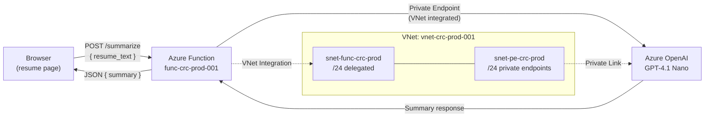
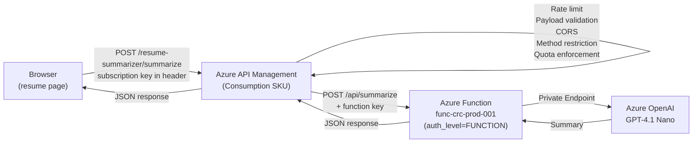

# Resume Summarizer Implementation (Draft)

## Diagrams

**TODO:** Merge both diagrams.

## OpenAI Deployment

- GPT-4.1-nano is chosen because of its cost-effectiveness for demo projects, in production environments model selection must carry other considerations like performance or precision to complete the tasks.
- Input length limit: 10,000 characters (~2,500 tokens) - Enforced client side and at API level (after `.strip()`).
- Payload size validation: rejects requests over 65,536 bytes (~10K chars + non-ASCII text + JSON overhead) - Enforced at APIM level.
- OpenAI API style: Using the Responses API (client.responses.create()) instead of Chat Completions.
- Outbound data loss prevention is a non issue here as only basic inference for summarization is performed which is then return to the web client. No tool calls or model-initated access to external access is supported as the current pipeline is one way from the wep app to the model deployment. Also, data is processed within an **Enterprise Date Boundary** meaning:
    - Resumes submitted will never be used to train models.
    - Summaries will be processed statelessly in memory (subject to transient abuse logs).

## Changes to the current project

**TODO:** Finish section.

### Backend Infrastructure

**TODO:** Finish section.

### Python API

**TODO:** Finish section.

- Used `functools.lru_cache` to cache Azure Open AI client and allow for warn calls to reuse it while ensuring authentication calls to Microsoft Foundry only occur after environment validation is done so the worker process doesn't crash during host initialization.

### Frontend

**TODO:** Finish section.

## Security and performance considerations

- Monitoring should be set for: 
    - TPM, RPM  and budget for OpenAI deployment.
    - `rate-limit` and `quota` exhaustion for APIM.
- Consider using key vault to store function key to be use by azure apim via managed identity, this way there’s no need for the value to be stored in terraform state outside of azure
- I think for the outbound IP whitelisting of the azure APIM instance to be done in the function app network settings (closing the gap in case of function key exposure), I need to upgrade as consumptions SKU doesn’t support static IPs. Also, it would be necessary to bring visitor_counter into the azure APIM because it uses the same function app. Region-level whitelisting of Azure datacenter could be explored as well if security requirements allow for it.
- Unfortunately, both rate-limiting-by-key and quota-by-key are not possible in the consumption tier so subscription based limiting is the next best thing. Cannot separate malicious traffic from legitimate traffic (shared `rate-limit` and `quota` allowance) so a potential attacker could cause `429` for all visitors. This risk is acceptable in demo projects like this one but cannot be recommended in production environments where traffic must be protected for legitimate users while malicious traffic is blocked/throttled.
- The subscription key to call the API will be manually injected post deployment on JavaScript and an automated fix will be implemented after a minimum viable product is functional (the fix could add unforeseen frontend architecture changes outside of the scope os this PR).
- A temporal guard is added on [`resume-summarizer.js`](../../frontend/resume/src/resume-summarizer/resume-summarizer.js) so if the subscription key is missing than prevent an unhandled failed operation.
- The risk of publishing the subscription key in static JavaScript is fine in this case as it only provides throttling functionality, the function is authenticated and the OpenAI deployment is behind a private endpoint accessible through managed identity only which provide the real security.
