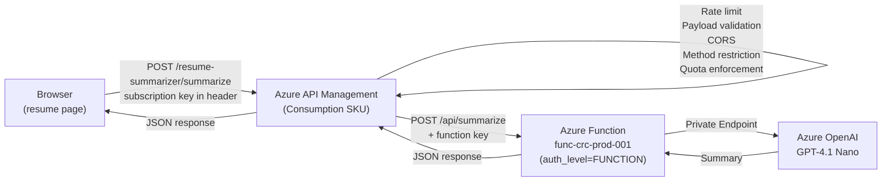

# Azure API Management Ingress Protection — Implementation Plan

## Goal

Add an ingress protection layer for the `resume_summarizer` Azure Function using **Azure API Management (Consumption SKU)**. The APIM gateway will sit between the frontend and the function, enforcing rate limiting, payload size validation, CORS, HTTP method restrictions, and usage quotas. The function's auth level will be upgraded from `ANONYMOUS` to `FUNCTION`, and APIM will authenticate to it using a function key stored as a named value.



---

## User Review Required

> [!IMPORTANT]
> **Consumption SKU Limitation — No `rate-limit-by-key` or `quota-by-key`**: The Consumption SKU does **not** support `rate-limit-by-key` (IP-based) or `quota-by-key` policies. Only subscription-based `rate-limit` and `quota` policies are available. This plan uses **subscription-based rate limiting and quotas**, which effectively protect the API since every request to the APIM endpoint requires a subscription key. The subscription key is embedded in the frontend JavaScript, so all browser traffic shares the same subscription and is collectively rate-limited.

> [!IMPORTANT]
> **Frontend URL Change**: The frontend JavaScript will be updated to call the APIM gateway URL instead of the function app URL directly. The function app endpoint will still be accessible directly (with a function key), but the intended public traffic flow is through APIM.

> [!IMPORTANT]
> **CORS Handling**: CORS will be managed exclusively at the APIM level for the resume summarizer. The function app's existing CORS configuration remains unchanged for the `visitor_counter` endpoint (which is not routed through APIM).

> [!WARNING]
> **Subscription Key Exposure**: The APIM subscription key will be embedded in the frontend JavaScript. This is acceptable because: (1) the key only grants access to a rate-limited/quota-constrained API, (2) the function key provides backend authentication, and (3) the real security boundary is the OpenAI private endpoint + managed identity. The subscription key serves as a throttling mechanism, not a secret authentication token.

> [!IMPORTANT]
> **Cost**: APIM Consumption tier costs ~$3.50 per 1M API calls, with the first 1M calls/month free. For a personal resume project, this is effectively free.

---

## Proposed Changes

### Infrastructure — Terraform

All new resources are added to [`main.tf`](file:///workspaces/cloud-resume-challenge/azure/backend-resources/main.tf) and [`variables.tf`](file:///workspaces/cloud-resume-challenge/azure/backend-resources/variables.tf), following the existing flat resource structure. The [`provider.tf`](file:///workspaces/cloud-resume-challenge/azure/backend-resources/provider.tf) will be updated to register the `Microsoft.ApiManagement` resource provider.

---

#### [MODIFY] `provider.tf` — Add Resource Provider

```diff
 provider "azurerm" {
   resource_providers_to_register = [
     "Microsoft.Web",
     "Microsoft.App",
     "Microsoft.DocumentDB",
     "Microsoft.Network",
     "Microsoft.Storage",
     "Microsoft.Insights",
     "Microsoft.Logic",
-    "Microsoft.CognitiveServices"
+    "Microsoft.CognitiveServices",
+    "Microsoft.ApiManagement"
   ]
```

---

#### [MODIFY] `variables.tf` — Add APIM Variables

```hcl
variable "apim_name" {
  description = "Name of the Azure API Management instance."
  default     = "apim-crc-prod-001"
  type        = string
}

variable "apim_publisher_name" {
  description = "Publisher name for APIM."
  default     = "Cloud Resume Challenge"
  type        = string
}

variable "apim_publisher_email" {
  description = "Publisher email for APIM."
  default     = "vegasjj@gmail.com"
  type        = string
}
```

---

#### [MODIFY] `main.tf` — Add APIM Resources

##### 1. Retrieve Function App Host Keys

```hcl
data "azurerm_function_app_host_keys" "func_keys" {
  name                = azurerm_function_app_flex_consumption.func.name
  resource_group_name = azurerm_resource_group.rg.name
}
```

##### 2. API Management Instance (Consumption SKU)

```hcl
resource "azurerm_api_management" "apim" {
  name                = var.apim_name
  location            = azurerm_resource_group.rg.location
  resource_group_name = azurerm_resource_group.rg.name
  publisher_name      = var.apim_publisher_name
  publisher_email     = var.apim_publisher_email
  sku_name            = "Consumption_0"
}
```

##### 3. Named Value — Function Key (Secret)

Stores the function app's default function key as a secret named value so it can be referenced in policies without exposing the value in XML.

```hcl
resource "azurerm_api_management_named_value" "func_key" {
  name                = "func-crc-default-key"
  resource_group_name = azurerm_resource_group.rg.name
  api_management_name = azurerm_api_management.apim.name
  display_name        = "func-crc-default-key"
  value               = data.azurerm_function_app_host_keys.func_keys.default_function_key
  secret              = true
}
```

##### 4. API Definition

```hcl
resource "azurerm_api_management_api" "resume_api" {
  name                = "resume-summarizer-api"
  resource_group_name = azurerm_resource_group.rg.name
  api_management_name = azurerm_api_management.apim.name
  revision            = "1"
  display_name        = "Resume Summarizer API"
  path                = "resume-summarizer"
  protocols           = ["https"]
  subscription_required = true
  service_url         = "https://${azurerm_function_app_flex_consumption.func.default_hostname}/api"
}
```

##### 5. API Operation — POST /summarize

```hcl
resource "azurerm_api_management_api_operation" "summarize" {
  operation_id        = "summarize-resume"
  api_name            = azurerm_api_management_api.resume_api.name
  api_management_name = azurerm_api_management.apim.name
  resource_group_name = azurerm_resource_group.rg.name
  display_name        = "Summarize Resume"
  method              = "POST"
  url_template        = "/summarize"
}
```

##### 6. API-Level Policy — All Protections

The policy is applied at the **API level** (not operation level) to cover all operations including the implicit OPTIONS preflight.

The policy XML implements:
- **CORS** — Allows `https://resume.technicalmind.cloud` origin with POST method
- **HTTP method restriction** — Blocks all methods except POST and OPTIONS (preflight)
- **Payload size validation** — Rejects requests over 15,000 bytes (~10K chars + JSON overhead)
- **Rate limiting** — 5 calls per 60 seconds per subscription (appropriate for AI summarization — prevents abuse while allowing normal use)
- **Quota** — 100 calls per day per subscription (caps daily OpenAI cost at ~$0.01)
- **Function key authentication** — Appends the function key as `x-functions-key` header to the backend request

```hcl
resource "azurerm_api_management_api_policy" "resume_api_policy" {
  api_name            = azurerm_api_management_api.resume_api.name
  api_management_name = azurerm_api_management.apim.name
  resource_group_name = azurerm_resource_group.rg.name

  xml_content = <<XML
<policies>
    <inbound>
        <base />
        <cors allow-credentials="false">
            <allowed-origins>
                <origin>https://resume.technicalmind.cloud</origin>
            </allowed-origins>
            <allowed-methods preflight-result-max-age="600">
                <method>POST</method>
                <method>OPTIONS</method>
            </allowed-methods>
            <allowed-headers>
                <header>Content-Type</header>
                <header>Ocp-Apim-Subscription-Key</header>
            </allowed-headers>
        </cors>
        <choose>
            <when condition='@(context.Request.Body != null &amp;&amp; context.Request.Body.As&lt;byte[]&gt;(preserveContent: true).Length &gt; 15000)'>
                <return-response>
                    <set-status code="413" reason="Payload Too Large" />
                    <set-header name="Content-Type" exists-action="override">
                        <value>application/json</value>
                    </set-header>
                    <set-body>{"message": "Request payload exceeds maximum size of 15,000 bytes.", "error_code": "PAYLOAD_TOO_LARGE"}</set-body>
                </return-response>
            </when>
        </choose>
        <rate-limit calls="5" renewal-period="60" />
        <quota calls="100" renewal-period="86400" />
        <set-header name="x-functions-key" exists-action="override">
            <value>{{func-crc-default-key}}</value>
        </set-header>
    </inbound>
    <backend>
        <base />
    </backend>
    <outbound>
        <base />
    </outbound>
    <on-error>
        <base />
        <choose>
            <when condition='@(context.LastError != null &amp;&amp; context.LastError.Reason == "OperationNotFound")'>
                <return-response>
                    <set-status code="405" reason="Method Not Allowed" />
                    <set-header name="Content-Type" exists-action="override">
                        <value>application/json</value>
                    </set-header>
                    <set-header name="Allow" exists-action="override">
                        <value>POST, OPTIONS</value>
                    </set-header>
                    <set-body>{"message": "Only POST requests are allowed.", "error_code": "METHOD_NOT_ALLOWED"}</set-body>
                </return-response>
            </when>
        </choose>
    </on-error>
</policies>
XML
}
```

**Policy value rationale:**

| Protection | Value | Rationale |
|------------|-------|-----------|
| Rate limit | 5 calls / 60s | AI summarization is not a rapid-fire operation. 5 req/min allows comfortable human use while preventing scripted abuse |
| Quota | 100 calls / day | Caps daily OpenAI spend at ~$0.01. A personal resume site won't legitimately need >100 summaries/day |
| Payload size | 15,000 bytes | 10K char text + JSON key/overhead + encoding margin. Prevents abuse via massive payloads |
| CORS origin | `resume.technicalmind.cloud` | Only the legitimate frontend domain |
| Methods | POST, OPTIONS | POST for the API call, OPTIONS for CORS preflight |

##### 7. Product & Subscription

APIM Consumption SKU requires a product to manage subscriptions. We create a product and a subscription for the frontend application:

```hcl
resource "azurerm_api_management_product" "resume_product" {
  product_id            = "resume-summarizer"
  api_management_name   = azurerm_api_management.apim.name
  resource_group_name   = azurerm_resource_group.rg.name
  display_name          = "Resume Summarizer"
  subscription_required = true
  approval_required     = false
  published             = true
}

resource "azurerm_api_management_product_api" "resume_product_api" {
  api_name            = azurerm_api_management_api.resume_api.name
  product_id          = azurerm_api_management_product.resume_product.product_id
  api_management_name = azurerm_api_management.apim.name
  resource_group_name = azurerm_resource_group.rg.name
}

resource "azurerm_api_management_subscription" "frontend_sub" {
  api_management_name = azurerm_api_management.apim.name
  resource_group_name = azurerm_resource_group.rg.name
  display_name        = "Frontend Resume App"
  product_id          = azurerm_api_management_product.resume_product.id
  state               = "active"
}
```

---

### Azure Function — Python Code

#### [MODIFY] `function_app.py` — Change Auth Level

The `resume_summarizer` function's route changes from `resume_summarizer` to `summarize` (to align with the APIM operation's `url_template`), and its auth level changes from implicit ANONYMOUS to explicit `FUNCTION`.

```diff
-@app.route(route="resume_summarizer", methods=["POST"])
+@app.route(route="summarize", methods=["POST"], auth_level=func.AuthLevel.FUNCTION)
```

This is the **only** change to `function_app.py`. The `visitor_counter` function continues to use the app-level `ANONYMOUS` auth.

---

### Frontend — JavaScript

#### [MODIFY] `resume-summarizer.js` — Update API Endpoint

The frontend will call the APIM gateway URL instead of the function app URL directly. The subscription key is sent via the `Ocp-Apim-Subscription-Key` header.

> [!NOTE]
> The APIM subscription key will be obtained after `terraform apply` from the `azurerm_api_management_subscription.frontend_sub` resource. The key will need to be updated in the JavaScript file post-deployment, or managed via a Terraform output.

```diff
-    const API_ENDPOINT = "https://func-crc-prod-001.azurewebsites.net/api/resume_summarizer";
+    const API_ENDPOINT = "https://apim-crc-prod-001.azure-api.net/resume-summarizer/summarize";
+    const APIM_SUBSCRIPTION_KEY = ""; // Set after deployment from terraform output
```

The `fetch` call will include the subscription key header:

```diff
             const response = await fetch(API_ENDPOINT, {
                 method: "POST",
-                headers: { "Content-Type": "application/json" },
+                headers: {
+                    "Content-Type": "application/json",
+                    "Ocp-Apim-Subscription-Key": APIM_SUBSCRIPTION_KEY,
+                },
                 body: JSON.stringify({ resume_text: resumeText }),
                 signal: AbortSignal.timeout(REQUEST_TIMEOUT_MS),
             });
```

Additionally, error handling will be updated to handle APIM-specific error responses (429 Too Many Requests, 405 Method Not Allowed, 413 Payload Too Large):

```javascript
            if (response.status === 405) {
                setStatus("Invalid request. Please try again");
                return;
            }

            if (response.status === 429) {
                setStatus("Too many requests. Please wait a moment and try again.");
                return;
            }

            if (response.status === 413) {
                setStatus("Your resume text is too long. Please shorten it and try again.");
                return;
            }

            if (!response.ok) {
                // existing error handling
            }
```

---

## New Terraform Resources Summary

| Resource | Type | Purpose |
|----------|------|---------|
| `data.azurerm_function_app_host_keys.func_keys` | Data source | Retrieves the function app's default function key |
| `azurerm_api_management.apim` | APIM instance | Consumption SKU gateway |
| `azurerm_api_management_named_value.func_key` | Named value | Stores function key as secret for policy reference |
| `azurerm_api_management_api.resume_api` | API definition | Defines the resume summarizer API |
| `azurerm_api_management_api_operation.summarize` | Operation | POST /summarize endpoint |
| `azurerm_api_management_api_policy.resume_api_policy` | API policy | CORS, rate limit, quota, payload validation, method restriction, function key injection |
| `azurerm_api_management_product.resume_product` | Product | Groups the API under a subscribable product |
| `azurerm_api_management_product_api.resume_product_api` | Product ↔ API link | Associates API with product |
| `azurerm_api_management_subscription.frontend_sub` | Subscription | Frontend app's subscription with auto-generated keys |

---

## Summary of All Files Changed

| File | Action | Description |
|------|--------|-------------|
| [`provider.tf`](file:///workspaces/cloud-resume-challenge/azure/backend-resources/provider.tf) | MODIFY | Register `Microsoft.ApiManagement` resource provider |
| [`variables.tf`](file:///workspaces/cloud-resume-challenge/azure/backend-resources/variables.tf) | MODIFY | Add 3 APIM variables |
| [`main.tf`](file:///workspaces/cloud-resume-challenge/azure/backend-resources/main.tf) | MODIFY | Add 8 APIM resources + 1 data source |
| [`function_app.py`](file:///workspaces/cloud-resume-challenge/azure/backend-resources/visitor-counter/function_app.py) | MODIFY | Change route to `summarize` and auth level to `FUNCTION` |
| [`resume-summarizer.js`](file:///workspaces/cloud-resume-challenge/frontend/resume/src/resume-summarizer/resume-summarizer.js) | MODIFY | Update API endpoint to APIM gateway, add subscription key header, add 429/413/405 error handling |

---

## Verification Plan

### Automated Tests

1. **Terraform validation**:
   ```bash
   cd azure/backend-resources
   terraform fmt -check
   terraform validate
   terraform plan
   ```

2. **Python compilation**:
   ```bash
   python3 -m py_compile azure/backend-resources/visitor-counter/function_app.py
   ```

3. **Existing tests still pass** (visitor counter):
   ```bash
   cd azure/tests
   python -m pytest test_api.py -v
   ```

### Manual Verification

1. **After `terraform apply`**:
   - Verify APIM instance created in Azure Portal under `rg-crc-backend-prod-001`
   - Confirm the API and operation are visible in the APIM blade
   - Confirm the named value `func-crc-default-key` exists (marked as secret)
   - Confirm the product and subscription are created

2. **Policy enforcement** via `curl`:
   ```bash
   # Get subscription key from Terraform output or Portal
   SUB_KEY="<subscription-key>"

   # Valid request — should succeed
   curl -X POST "https://apim-crc-prod-001.azure-api.net/resume-summarizer/summarize" \
     -H "Content-Type: application/json" \
     -H "Ocp-Apim-Subscription-Key: $SUB_KEY" \
     -d '{"resume_text": "5 years cloud engineering experience..."}'

   # Missing subscription key — should return 401
   curl -X POST "https://apim-crc-prod-001.azure-api.net/resume-summarizer/summarize" \
     -H "Content-Type: application/json" \
     -d '{"resume_text": "test"}'

   # Wrong method — should return 405
   curl -X GET "https://apim-crc-prod-001.azure-api.net/resume-summarizer/summarize" \
     -H "Ocp-Apim-Subscription-Key: $SUB_KEY"

   # Rate limit test — 6 rapid calls, at least one call should return 429
   for i in {1..6}; do
     curl -s -o /dev/null -w "%{http_code}\n" -X POST \
       "https://apim-crc-prod-001.azure-api.net/resume-summarizer/summarize" \
       -H "Content-Type: application/json" \
       -H "Ocp-Apim-Subscription-Key: $SUB_KEY" \
       -d '{"resume_text": "test resume"}';
   done
   ```

3. **Direct function access blocked without key**:
   ```bash
   # Without function key — should return 401
   curl -X POST "https://func-crc-prod-001.azurewebsites.net/api/summarize" \
     -H "Content-Type: application/json" \
     -d '{"resume_text": "test"}'
   ```

4. **Frontend verification**:
   - Open `https://resume.technicalmind.cloud`
   - Verify the visitor counter still works (unaffected)
   - Test the resume summarizer form
   - Verify rate limit error message appears after rapid submissions
