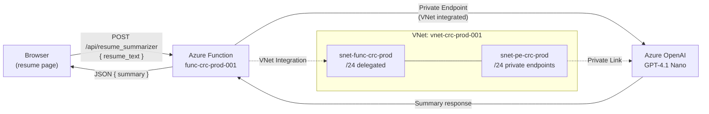

# Azure OpenAI Resume Summarizer — Implementation Plan

## Goal

Add an AI-powered resume summarization feature to the Cloud Resume Challenge. A user pastes resume text into a form on the resume page, clicks "Summarize", and the text is sent to the existing Azure Function App (`func-crc-prod-001`). The function calls an Azure OpenAI GPT-4.1 Nano model — authenticated via the function's existing **system-assigned managed identity** — and returns a concise summary to be displayed on the page.

The Azure OpenAI resource is secured behind a **private endpoint**, and the function app is VNet-integrated so it can reach the model through the private link. All infrastructure follows the existing flat Terraform structure in `backend-resources/main.tf`.



---

## User Review Required

> [!IMPORTANT]
> **Function App Restart**: Adding `virtual_network_subnet_id` to the existing function app will trigger a restart. The function app and all its functions (including `visitor_counter`) will be temporarily unavailable during the restart — typically a few seconds. This is not a full redeployment; Terraform updates the resource in-place.

> [!IMPORTANT]
> **CORS Update**: The function app's CORS configuration will be unchanged. The resume summarizer endpoint will be callable from the same origins already allowed (`https://resume.technicalmind.cloud`, `https://portal.azure.com`).

> [!IMPORTANT]
> **Cost Impact**: GPT-4.1 Nano is the most cost-effective Azure OpenAI model at **$0.10/1M input tokens** and **$0.40/1M output tokens**. A typical resume (~500 words ≈ 700 tokens) with a ~100-word summary (~140 tokens) costs approximately **$0.0001 per request**. The VNet, Private Endpoint, and Private DNS Zone resources are free or negligible cost.

---

## Resolved Questions

- **Azure OpenAI Region**: `eastus` is confirmed — GPT-4.1 Nano is available there.
- **Input length limit**: 10,000 characters (~2,500 tokens) — accepted.
- **OpenAI API style**: Using the **Responses API** (`client.responses.create()`) instead of Chat Completions.
- **Error logging**: All error responses use the default `exc_info=True` for consistent server-side log traceability, matching the `visitor_counter` pattern.
- **Terraform versions**: Updated for `azurerm ~>5.0.0` and Terraform `~>1.15.0`.

---

## Proposed Changes

The implementation touches three layers: **Terraform infrastructure**, **Azure Function Python code**, and **Frontend HTML/CSS/JS**.

---

### Infrastructure — Terraform

All new resources are added to [main.tf](file:///workspaces/cloud-resume-challenge/azure/backend-resources/main.tf) and [variables.tf](file:///workspaces/cloud-resume-challenge/azure/backend-resources/variables.tf), following the existing flat resource structure.

> [!NOTE]
> **azurerm v5.0 consideration**: The provider's `resource_provider_registrations` now defaults to `none`. The required resource providers (`Microsoft.Web`, `Microsoft.DocumentDB`, `Microsoft.Storage`, `Microsoft.Insights`, `Microsoft.Logic`, `Microsoft.Network`, `Microsoft.CognitiveServices`) must be registered in the subscription. If the existing resources are already deployed, the providers are already registered. `Microsoft.CognitiveServices` and `Microsoft.Network` (for VNet/Private Endpoint) may need explicit registration if not already present.

#### [MODIFY] `variables.tf`

Add new variables for the Azure OpenAI and networking resources:

```hcl
variable "openai_account_name" {
  description = "Name of the Azure OpenAI account."
  default     = "oai-crc-prod-001"
  type        = string
}

variable "openai_model_name" {
  description = "Name of the Azure OpenAI model deployment."
  default     = "gpt-41-nano"
  type        = string
}

variable "openai_sku" {
  description = "SKU for the Azure OpenAI account."
  default     = "S0"
  type        = string
}

variable "vnet_name" {
  description = "Name of the Virtual Network."
  default     = "vnet-crc-prod-001"
  type        = string
}

variable "subnet_function_name" {
  description = "Name of the subnet delegated to the Function App."
  default     = "snet-func-crc-prod"
  type        = string
}

variable "subnet_pe_name" {
  description = "Name of the subnet for private endpoints."
  default     = "snet-pe-crc-prod"
  type        = string
}
```

#### [MODIFY] `main.tf`

The following resource blocks will be **appended** to the existing `main.tf`. The existing function app resource will also be **modified** to add VNet integration and OpenAI environment variables.

##### 1. Virtual Network & Subnets

```hcl
resource "azurerm_virtual_network" "vnet" {
  name                = var.vnet_name
  location            = azurerm_resource_group.rg.location
  resource_group_name = azurerm_resource_group.rg.name
  address_space       = ["10.0.0.0/16"]
  depends_on = [
    azurerm_resource_group.rg
  ]
}

resource "azurerm_subnet" "snet_func" {
  name                 = var.subnet_function_name
  resource_group_name  = azurerm_resource_group.rg.name
  virtual_network_name = azurerm_virtual_network.vnet.name
  address_prefixes     = ["10.0.1.0/24"]

  delegation {
    name = "func-delegation"
    service_delegation {
      name = "Microsoft.App/environments"
      actions = [
        "Microsoft.Network/virtualNetworks/subnets/action"
      ]
    }
  }
}

resource "azurerm_subnet" "snet_pe" {
  name                 = var.subnet_pe_name
  resource_group_name  = azurerm_resource_group.rg.name
  virtual_network_name = azurerm_virtual_network.vnet.name
  address_prefixes     = ["10.0.2.0/24"]
}
```

##### 2. Azure OpenAI Account & Model Deployment

```hcl
resource "azurerm_cognitive_account" "openai" {
  name                          = var.openai_account_name
  location                      = azurerm_resource_group.rg.location
  resource_group_name           = azurerm_resource_group.rg.name
  kind                          = "OpenAI"
  sku_name                      = var.openai_sku
  public_network_access_enabled = false
  custom_subdomain_name         = var.openai_account_name
  depends_on = [
    azurerm_resource_group.rg
  ]
}

resource "azurerm_cognitive_deployment" "gpt41nano" {
  name                 = var.openai_model_name
  cognitive_account_id = azurerm_cognitive_account.openai.id

  model {
    format  = "OpenAI"
    name    = "gpt-4.1-nano"
    version = "2025-04-14"
  }

  sku {
    name     = "GlobalStandard"
    capacity = 10
  }
}
```

##### 3. Private Endpoint & DNS

```hcl
resource "azurerm_private_endpoint" "openai_pe" {
  name                = "pe-oai-crc-prod-001"
  location            = azurerm_resource_group.rg.location
  resource_group_name = azurerm_resource_group.rg.name
  subnet_id           = azurerm_subnet.snet_pe.id

  private_service_connection {
    name                           = "psc-oai-crc-prod-001"
    private_connection_resource_id = azurerm_cognitive_account.openai.id
    subresource_names              = ["account"]
    is_manual_connection           = false
  }

  private_dns_zone_group {
    name                 = "openai-dns-zone-group"
    private_dns_zone_ids = [azurerm_private_dns_zone.openai_dns.id]
  }
}

resource "azurerm_private_dns_zone" "openai_dns" {
  name                = "privatelink.openai.azure.com"
  resource_group_name = azurerm_resource_group.rg.name
}

resource "azurerm_private_dns_zone_virtual_network_link" "openai_dns_link" {
  name                  = "openai-dns-vnet-link"
  resource_group_name   = azurerm_resource_group.rg.name
  private_dns_zone_name = azurerm_private_dns_zone.openai_dns.name
  virtual_network_id    = azurerm_virtual_network.vnet.id
}
```

##### 4. RBAC — Cognitive Services OpenAI User Role Assignment

```hcl
resource "azurerm_role_assignment" "func_openai_user" {
  scope                = azurerm_cognitive_account.openai.id
  role_definition_name = "Cognitive Services OpenAI User"
  principal_id         = azurerm_function_app_flex_consumption.func.identity.0.principal_id
}
```

##### 5. Modify Existing Function App

The existing `azurerm_function_app_flex_consumption.func` resource will be updated with two changes:

```diff
 resource "azurerm_function_app_flex_consumption" "func" {
   name                                     = var.function_app_name
   resource_group_name                      = azurerm_resource_group.rg.name
   location                                 = azurerm_resource_group.rg.location
   service_plan_id                          = azurerm_service_plan.sp.id
   
   storage_container_type                   = "blobContainer"
   storage_container_endpoint               = "${azurerm_storage_account.st.primary_blob_endpoint}${azurerm_storage_container.sc.name}"
   storage_authentication_type              = "StorageAccountConnectionString"
   storage_access_key                       = azurerm_storage_account.st.primary_access_key
   runtime_name                             = "python"
   runtime_version                          = "3.12"
   webdeploy_publish_basic_authentication_enabled = false
   # TO-DO Need to dig into this
   client_certificate_mode                  = "Required"
   https_only                               = true
+  virtual_network_subnet_id                = azurerm_subnet.snet_func.id
   identity {
     type = "SystemAssigned"
   }
   
   site_config {
     application_insights_connection_string = azurerm_application_insights.ai.connection_string
     http2_enabled                          = true
     cors {
       allowed_origins = ["https://portal.azure.com", "https://resume.technicalmind.cloud"]
     }
   }
 
   app_settings = {
     COSMOS_DB_ACCOUNT_NAME  = var.cosmosdb_account_name
     COSMOS_DB_PARTITION_KEY = "counter_partitionkey"
     COSMOS_DB_ROW_KEY       = "counter_rowkey"
     COSMOS_DB_TABLE_NAME    = var.cosmosdb_table_name
+    AZURE_OPENAI_ENDPOINT   = azurerm_cognitive_account.openai.endpoint
+    AZURE_OPENAI_DEPLOYMENT = var.openai_model_name
   }
   # Dig into the need of this tag
   tags = { 
     "hidden-link: /app-insights-resource-id" = azurerm_application_insights.ai.id
    }
 }
```

---

### Azure Function — Python Code

#### [MODIFY] `visitor-counter/requirements.in`

Add the `openai` SDK dependency:

```diff
 # Uncomment to enable Azure Monitor OpenTelemetry
 # Ref: aka.ms/functions-azure-monitor-python
 # azure-monitor-opentelemetry
 
 azure-functions
 azure-data-tables
 azure-identity
+openai
```

The `requirements.txt` lockfile will be regenerated via `uv pip compile requirements.in -o requirements.txt`.

#### [MODIFY] `visitor-counter/function_app.py`

Add a new `resume_summarizer` function alongside the existing `visitor_counter`. The existing function is **not modified** — only new code is appended.

Uses the **Responses API** (`client.responses.create()`) instead of the Chat Completions API, providing a cleaner interface with `input=` and `instructions=` parameters and `response.output_text` for direct output access.

All error responses use the default `exc_info=True` (inherited from `create_error_response`) for consistent server-side log traceability, matching the `visitor_counter` pattern.

```python
# --- Resume Summarizer Function ---
from openai import AzureOpenAI
from azure.identity import get_bearer_token_provider

openai_endpoint = get_env_var('AZURE_OPENAI_ENDPOINT')
openai_deployment = get_env_var('AZURE_OPENAI_DEPLOYMENT')

SYSTEM_PROMPT = """You are a professional resume reviewer. Given a resume text, produce a concise 
summary (3-5 sentences) highlighting the candidate's key qualifications, most relevant experience, 
and core technical skills. Be objective, professional, and focus on what makes this candidate stand out."""

MAX_RESUME_LENGTH = 10000

token_provider = get_bearer_token_provider(
    credential,
    "https://cognitiveservices.azure.com/.default"
)

@app.route(route="resume_summarizer", methods=["POST"])
def resume_summarizer(req: func.HttpRequest) -> func.HttpResponse:
    """
    Accepts resume text via POST and returns an AI-generated summary
    using Azure OpenAI GPT-4.1 Nano via system-assigned managed identity.
    Uses the Responses API for streamlined model interaction.
    
    Parameters:
    req (func.HttpRequest): The HTTP request with JSON body { "resume_text": "..." }
    
    Returns:
    func.HttpResponse: JSON response { "summary": "..." } or error details.
    """
    logging.info('Resume summarizer function processed a request.')

    # Validate environment variables
    openai_missing = []
    if not openai_endpoint:
        openai_missing.append('AZURE_OPENAI_ENDPOINT')
    if not openai_deployment:
        openai_missing.append('AZURE_OPENAI_DEPLOYMENT')
    if openai_missing:
        return create_error_response(
            generic_client_message,
            f"Missing required environment variables: {', '.join(openai_missing)}",
            500,
            "ENV_VAR_MISSING"
        )

    # Parse and validate request body
    try:
        req_body = req.get_json()
    except ValueError:
        return create_error_response(
            "Request body must be valid JSON with a 'resume_text' field.",
            "Invalid JSON in request body",
            400,
            "INVALID_REQUEST_BODY"
        )

    resume_text = req_body.get('resume_text', '').strip()
    if not resume_text:
        return create_error_response(
            "The 'resume_text' field is required and cannot be empty.",
            "Empty resume_text field",
            400,
            "EMPTY_RESUME_TEXT"
        )

    if len(resume_text) > MAX_RESUME_LENGTH:
        return create_error_response(
            f"Resume text must be {MAX_RESUME_LENGTH} characters or fewer.",
            f"Resume text length {len(resume_text)} exceeds limit {MAX_RESUME_LENGTH}",
            400,
            "RESUME_TEXT_TOO_LONG"
        )

    # Call Azure OpenAI via managed identity using the Responses API
    try:
        client = AzureOpenAI(
            azure_endpoint=openai_endpoint,
            azure_ad_token_provider=token_provider,
            api_version="2025-04-01-preview"
        )

        response = client.responses.create(
            model=openai_deployment,
            instructions=SYSTEM_PROMPT,
            input=resume_text,
            max_output_tokens=300,
            temperature=0.3
        )

        summary = response.output_text

    except Exception:
        return create_error_response(
            generic_client_message,
            "Failed to generate summary from Azure OpenAI",
            500,
            "OPENAI_API_FAILURE"
        )

    return func.HttpResponse(
        json.dumps({"summary": summary}),
        status_code=200,
        mimetype="application/json"
    )
```

**Key design decisions:**
- Reuses the existing `credential = DefaultAzureCredential()` already at module level
- Uses `get_bearer_token_provider` for proper token management with the Responses API
- Reuses the existing `create_error_response` helper and `generic_client_message`
- All errors use the default `exc_info=True` for server-side log traceability
- Uses `POST` method only (not GET) since we're sending resume text
- Input validation: non-empty, valid JSON, max 10,000 characters
- `temperature=0.3` for consistent, professional summaries
- `max_output_tokens=300` to keep summaries concise and costs low
- Uses the **Responses API** (`client.responses.create()`) with `input=` / `instructions=` / `response.output_text`

---

### Frontend — HTML, CSS, JavaScript

#### [NEW] `frontend/resume/src/resume-summarizer/resume-summarizer.js`

New JavaScript module for the summarizer form, following the same pattern as `visitor-counter.js`:

```javascript
document.addEventListener("DOMContentLoaded", function () {
    const form = document.getElementById("resume-summarizer-form");
    const textarea = document.getElementById("resume-text-input");
    const button = document.getElementById("summarize-btn");
    const resultContainer = document.getElementById("summary-result");
    const charCounter = document.getElementById("char-counter");
    const MAX_LENGTH = 10000;

    // Character counter
    textarea.addEventListener("input", function () {
        const remaining = MAX_LENGTH - textarea.value.length;
        charCounter.textContent = `${remaining.toLocaleString()} characters remaining`;
        charCounter.style.color = remaining < 500 ? "#c0392b" : "#999";
    });

    form.addEventListener("submit", function (e) {
        e.preventDefault();

        const resumeText = textarea.value.trim();
        if (!resumeText) {
            resultContainer.innerHTML =
                '<p class="summary-error">Please enter your resume text.</p>';
            return;
        }

        // Set loading state
        button.disabled = true;
        button.textContent = "Summarizing...";
        resultContainer.innerHTML =
            '<p class="summary-loading">Analyzing your resume...</p>';

        fetch(
            "https://func-crc-prod-001.azurewebsites.net/api/resume_summarizer",
            {
                method: "POST",
                headers: { "Content-Type": "application/json" },
                body: JSON.stringify({ resume_text: resumeText }),
            }
        )
            .then(async (response) => {
                const contentType = response.headers.get("content-type") || "";
                const rawText = await response.text();
                let data = null;

                if (contentType.includes("application/json")) {
                    try {
                        data = JSON.parse(rawText);
                    } catch (err) {
                        // fall back to text
                    }
                }

                if (!response.ok) {
                    const errorDetail =
                        data && data.message ? data.message : rawText;
                    throw new Error(
                        `Status code: ${response.status}. Detail: ${errorDetail}`
                    );
                }

                return data;
            })
            .then((data) => {
                if (data && data.summary) {
                    resultContainer.innerHTML = `<div class="summary-content"><h3>Summary</h3><p>${data.summary}</p></div>`;
                } else {
                    resultContainer.innerHTML =
                        '<p class="summary-error">No summary was returned. Please try again.</p>';
                }
            })
            .catch((error) => {
                console.error("Resume summarizer error:", error);
                resultContainer.innerHTML =
                    '<p class="summary-error">An error occurred while summarizing. Please try again later.</p>';
            })
            .finally(() => {
                button.disabled = false;
                button.textContent = "Summarize";
            });
    });
});
```

#### [MODIFY] `frontend/resume/index.html`

Add a script tag in `<head>` and a new section before the footer:

```diff
     <script src="./src/visitor-counter/visitor-counter.js" defer></script>
+    <script src="./src/resume-summarizer/resume-summarizer.js" defer></script>
 </head>
```

Add the summarizer form section between `</main>` and `<footer>`:

```html
    <section class="resume-summarizer-section">
        <div class="resume-summarizer-container">
            <h2>AI Resume Summarizer</h2>
            <p class="summarizer-description">Paste a resume below and get an AI-powered professional summary.</p>
            <form id="resume-summarizer-form">
                <textarea
                    id="resume-text-input"
                    placeholder="Paste your resume text here..."
                    maxlength="10000"
                    rows="8"
                ></textarea>
                <div class="summarizer-controls">
                    <span id="char-counter" class="char-counter">10,000 characters remaining</span>
                    <button type="submit" id="summarize-btn">Summarize</button>
                </div>
            </form>
            <div id="summary-result"></div>
        </div>
    </section>
```

#### [MODIFY] `frontend/resume/src/styles/styles.css`

Append new styles for the summarizer section. Designed to match the existing minimal grey/white aesthetic:

```css
/* --- Resume Summarizer --- */
.resume-summarizer-section {
    background-color: #f7f7f7;
    padding: 30px 0;
}

.resume-summarizer-container {
    max-width: 1000px;
    margin: 0 auto;
    padding: 25px 30px;
    background-color: #fff;
    border-radius: 4px;
    box-shadow: 0 1px 3px rgba(0, 0, 0, 0.08);
}

.resume-summarizer-container h2 {
    font-size: 20pt;
    font-weight: 600;
    margin-top: 0;
    margin-bottom: 5pt;
}

.summarizer-description {
    font-size: 10pt;
    color: #777;
    margin-bottom: 15pt;
}

#resume-text-input {
    width: 100%;
    padding: 12px;
    font-family: "Source Code Pro", monospace;
    font-size: 10pt;
    border: 1px solid #ddd;
    border-radius: 3px;
    resize: vertical;
    min-height: 120px;
    box-sizing: border-box;
    transition: border-color 0.2s ease;
}

#resume-text-input:focus {
    outline: none;
    border-color: #999;
}

.summarizer-controls {
    display: flex;
    justify-content: space-between;
    align-items: center;
    margin-top: 10px;
}

.char-counter {
    font-size: 8pt;
    color: #999;
}

#summarize-btn {
    font-family: "Raleway", sans-serif;
    font-size: 10pt;
    font-weight: 600;
    padding: 8px 24px;
    background-color: #333;
    color: #fff;
    border: none;
    border-radius: 3px;
    cursor: pointer;
    transition: background-color 0.2s ease;
}

#summarize-btn:hover {
    background-color: #555;
}

#summarize-btn:disabled {
    background-color: #aaa;
    cursor: not-allowed;
}

.summary-content {
    margin-top: 20px;
    padding: 15px;
    background-color: #fafafa;
    border-left: 3px solid #333;
    border-radius: 2px;
}

.summary-content h3 {
    font-size: 12pt;
    font-weight: 600;
    margin-top: 0;
    margin-bottom: 8pt;
}

.summary-content p {
    font-size: 10pt;
    line-height: 1.6;
    color: #444;
    margin: 0;
}

.summary-loading {
    margin-top: 15px;
    font-size: 10pt;
    color: #777;
    font-style: italic;
}

.summary-error {
    margin-top: 15px;
    font-size: 10pt;
    color: #c0392b;
}

@media (max-width: 800px) {
    .resume-summarizer-container {
        margin: 0 10px;
        padding: 20px 15px;
    }
}

@media (max-width: 500px) {
    .summarizer-controls {
        flex-direction: column;
        align-items: stretch;
        gap: 8px;
    }

    .char-counter {
        text-align: right;
    }

    #summarize-btn {
        width: 100%;
    }
}
```

---

## Summary of All Files Changed

| File | Action | Description |
|------|--------|-------------|
| [`variables.tf`](file:///workspaces/cloud-resume-challenge/azure/backend-resources/variables.tf) | MODIFY | Add 6 new variables for OpenAI + networking |
| [`main.tf`](file:///workspaces/cloud-resume-challenge/azure/backend-resources/main.tf) | MODIFY | Add VNet, subnets, OpenAI account, deployment, private endpoint, DNS, RBAC. Modify function app for VNet integration + env vars |
| [`requirements.in`](file:///workspaces/cloud-resume-challenge/azure/backend-resources/visitor-counter/requirements.in) | MODIFY | Add `openai` dependency |
| [`function_app.py`](file:///workspaces/cloud-resume-challenge/azure/backend-resources/visitor-counter/function_app.py) | MODIFY | Add `resume_summarizer` function using Responses API |
| [`index.html`](file:///workspaces/cloud-resume-challenge/frontend/resume/index.html) | MODIFY | Add script tag + summarizer form section |
| [`styles.css`](file:///workspaces/cloud-resume-challenge/frontend/resume/src/styles/styles.css) | MODIFY | Add summarizer CSS styles |
| [`resume-summarizer.js`](file:///workspaces/cloud-resume-challenge/frontend/resume/src/resume-summarizer/resume-summarizer.js) | NEW | JavaScript module for summarizer form |

---

## New Terraform Resources Summary

| Resource | Type | Purpose |
|----------|------|---------|
| `azurerm_virtual_network.vnet` | VNet | Network isolation for function ↔ OpenAI |
| `azurerm_subnet.snet_func` | Subnet | Delegated to `Microsoft.App/environments` for Flex Consumption |
| `azurerm_subnet.snet_pe` | Subnet | Hosts the private endpoint |
| `azurerm_cognitive_account.openai` | Azure OpenAI | GPT-4.1 Nano host with `public_network_access_enabled = false` |
| `azurerm_cognitive_deployment.gpt41nano` | Model deployment | GPT-4.1 Nano with GlobalStandard SKU, 10K TPM capacity |
| `azurerm_private_endpoint.openai_pe` | Private Endpoint | Private connectivity to OpenAI |
| `azurerm_private_dns_zone.openai_dns` | Private DNS Zone | Resolves `privatelink.openai.azure.com` |
| `azurerm_private_dns_zone_virtual_network_link.openai_dns_link` | DNS ↔ VNet Link | Enables DNS resolution within the VNet |
| `azurerm_role_assignment.func_openai_user` | RBAC | Grants `Cognitive Services OpenAI User` to the function's managed identity |

---

## Verification Plan

### Automated Tests

1. **Terraform validation**:
   ```bash
   cd azure/backend-resources
   terraform fmt -check
   terraform validate
   terraform plan
   ```

2. **Python dependency compilation**:
   ```bash
   cd azure/backend-resources/visitor-counter
   pip install uv
   uv pip compile requirements.in -o requirements.txt
   ```

3. **Existing tests still pass** (visitor counter):
   ```bash
   cd azure/tests
   pip install -r requirements.txt
   python -m pytest test_api.py -v
   ```

### Manual Verification

1. **After `terraform apply`**:
   - Verify all resources created in Azure Portal under `rg-crc-backend-prod-001`
   - Confirm the private endpoint shows "Approved" connection status
   - Confirm the function app shows VNet integration in the Networking blade
   - Verify the managed identity has `Cognitive Services OpenAI User` role on the OpenAI resource

2. **End-to-end test** via `curl`:
   ```bash
   curl -X POST https://func-crc-prod-001.azurewebsites.net/api/resume_summarizer \
     -H "Content-Type: application/json" \
     -d '{"resume_text": "John Doe, 5 years experience as a cloud engineer with AWS and Azure certifications. Led migration of 50+ workloads to Azure. Expert in Terraform, Kubernetes, and CI/CD pipelines."}'
   ```

3. **Frontend verification**:
   - Open `https://resume.technicalmind.cloud`
   - Verify the visitor counter still works
   - Scroll to the AI Resume Summarizer section
   - Paste sample resume text and click "Summarize"
   - Verify the summary appears below the form
   - Test edge cases: empty input, very long input, rapid clicks

4. **Error scenario testing**:
   - Submit empty text → should show client-side validation error
   - Submit text exceeding 10,000 chars → should show length error from API
