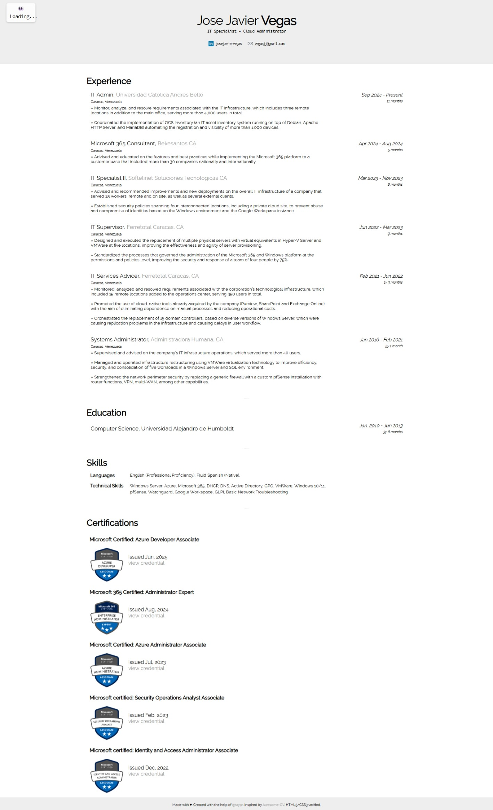

# Frontend Technical Specifications

This is a static website serving an HTML resume with a visitor counter.

## Summary

- [Resume Format Considerations](#resume-format-considerations)
  - [Resume Format Generation](#resume-format-generation)
- [HTML and CSS Adjustments](#html-and-css-adjustments)
- [Local Webserver Details](#local-webserver-details)
- [Frontend Framework Considerations](#frontend-framework-considerations)

## Resume Format Considerations

I'm choosing to use the [Harvard Resume Template format](https://cdn-careerservices.fas.harvard.edu/wp-content/uploads/sites/161/2025/09/2025-template_bullet.docx).

Even as I live in Venezuela and this format is not very well known in the country, I think it's better to use a standardized format in this case. It also helps that it's very flexible and to the point.

### Resume Format Generation

I know HTML and CSS a bit but I'm not going to code the resume from scratch. Instead I'm going to use a template with a close approximation the Harvard Resume format and modify it to my own taste. You can [access the original template here](https://github.com/stypr/resume-template).

This is how the finished version of my resume looks like: .

## HTML and CSS Adjustments

- Some contact information irrelevant to my needs was removed. Only LinkedIn and email were left.
- Core sections were left intact, except for **Portfolio** and **Patent** that were removed.
- The **Achievement/Awards** section was replaced by the **Certifications** section where I showcase relevant certs.
- The template uses tables instead of divs to hold most of the content so it complicates things when making it responsive (specially on mobile). I managed to adjust the text but I plan to include Flexbox and divs as soon as I have time.
- The **Certifications** section's code is not the most semantic either. It will be optimized with flexbox in a future version.
- The unneeded progress check in the footer was removed.
- The visitor-counter element is added.

## Local Webserver Details

As I'm using GitHub Codespaces as my local environment I need a way to expose a local port to track my changes as I make modifications (in a true local PC this wouldn't be necessary).

Node is installed by default in this environment so I can install [HTTP Server](https://www.npmjs.com/package/http-server) directly:

```sh
npm install --global http-server
```

I need to move to the root folder where my **index.html** file lives:

```sh
cd frontend/resume/
```

In order to serve the webpage I need to run:

```sh
http-server
```

You should see a similar output to this one:

```sh
Starting up http-server, serving ./

http-server version: 14.1.1

http-server settings: 
CORS: disabled
Cache: 3600 seconds
Connection Timeout: 120 seconds
Directory Listings: visible
AutoIndex: visible
Serve GZIP Files: false
Serve Brotli Files: false
Default File Extension: none

Available on:
  http://127.0.0.1:8080
  http://10.0.11.205:8080
Hit CTRL-C to stop the server
```

## Frontend Framework Considerations

It should be nice to add a React/Vite.js combo to serve the resume as a true web app, however, I will address this in a future version due to time constraints.
